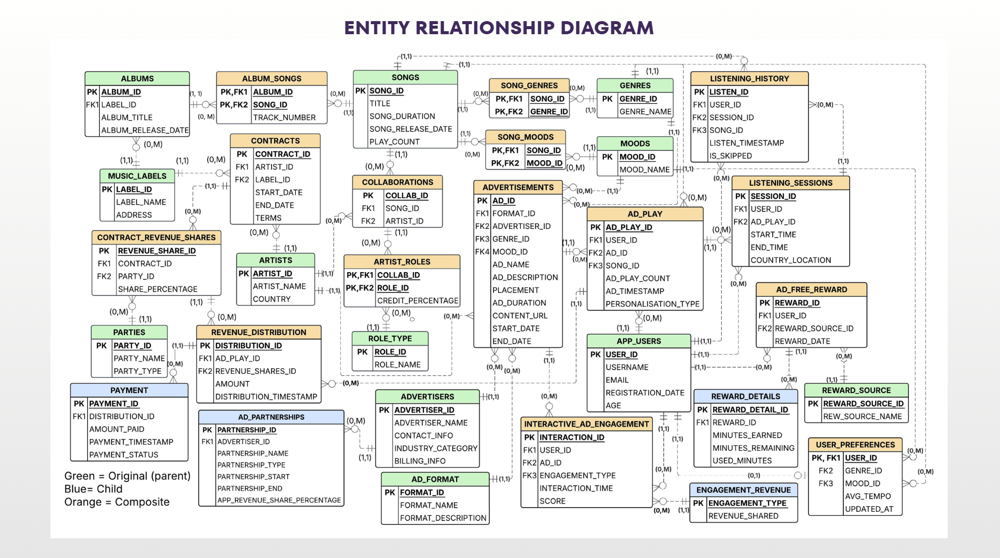
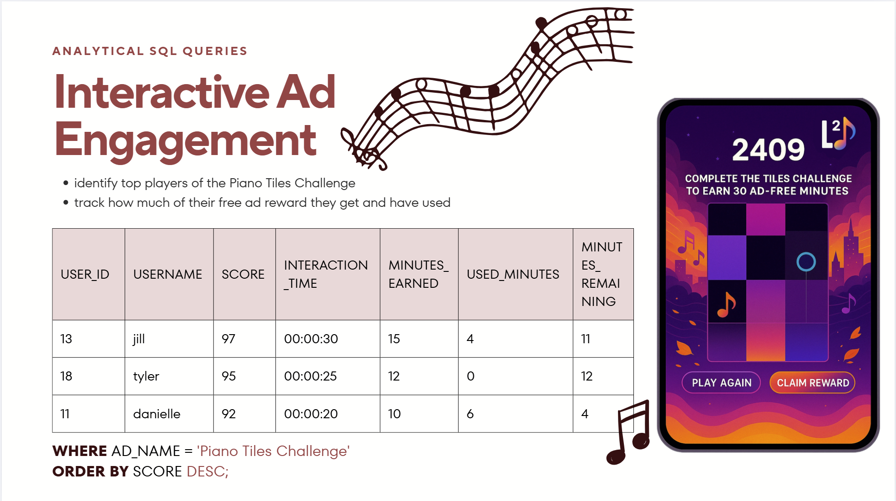
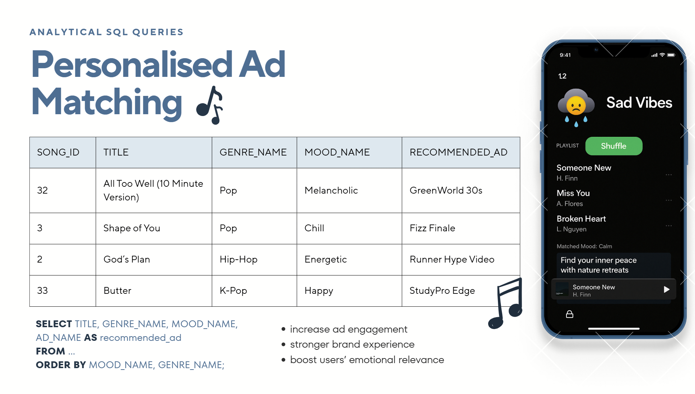
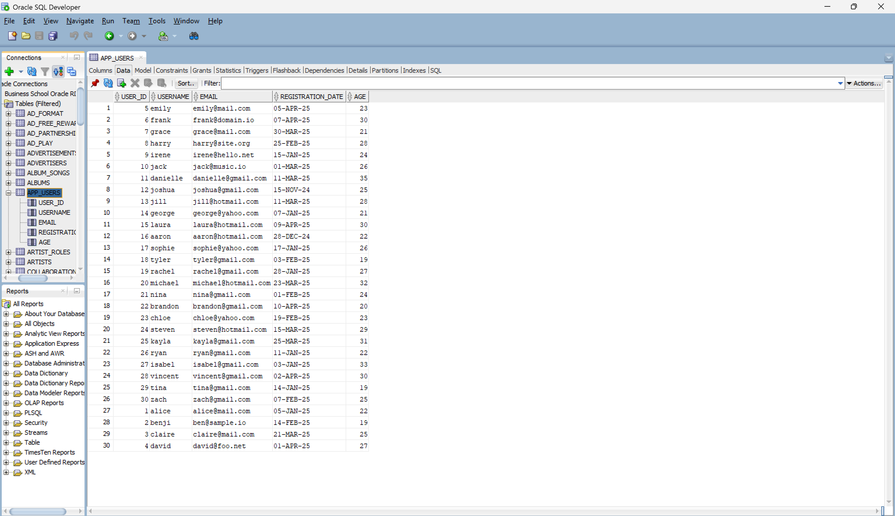

### 🏋️‍♂️ Whoop Progression Tracker  
[▶ Watch 40-second demo](https://www.youtube.com/watch?v=nXn7U-w8vI4)

|  |  |
|:--:|:--:|
| Log Workout | Last-vs-This Compare |

|  |  |
|:--:|:--:|
| 1-Week | 1-Month |

|   |  |   |
|:-:|:--------------------------------------------:|:-:|
|   | 6-Month                          |   |

- Built React Native module in **< 3 weeks** (≈ 1,900 LoC)  
- Validated with 25+ weightlifters _(including non-Whoop users)_; **100%** said they’d use this lightweight tracker  
- **95%** of 20 survey responders said they’d use a feature like this  
- Added **Add-Exercise** tab to eliminate need for official Whoop API sync  
- Feedback from **Whoop VP Growth & Sr Staff PM** → invited to upcoming beta

### 🎵 Ad-Supported Music Platform

|  |  |
|:--:|:--:|
| Entity-Relationship Diagram | Piano Tiles Ad Engagement Analytics |

|  |  |
|:--:|:--:|
| Personalized Ad Matching via SQL | Populated Mock Data in Oracle SQL |

- Engineered a **31-table Oracle schema (3NF)** and seeded **384 AI-generated rows** spanning artists, songs, albums, ads, and advertisers
- Wrote analytical queries that monitor users' **remaining ad-free minutes**, track **ad-royalty splits** per artist, and log **top artists and songs** all in **< 10s**
- Added gamified **“Piano Tiles” mini-game** to drive app engagement, allowing users to play in-app tracks to earn ad-free rewards
