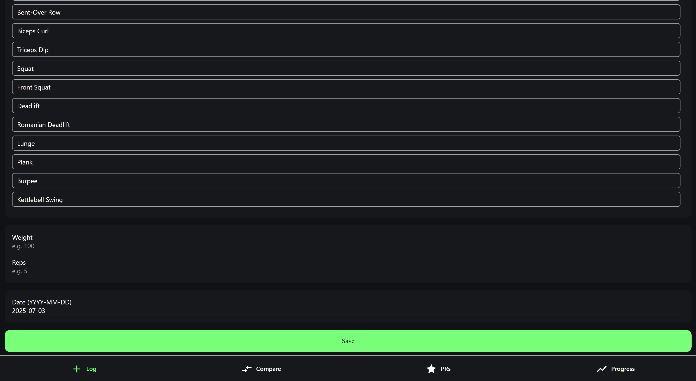
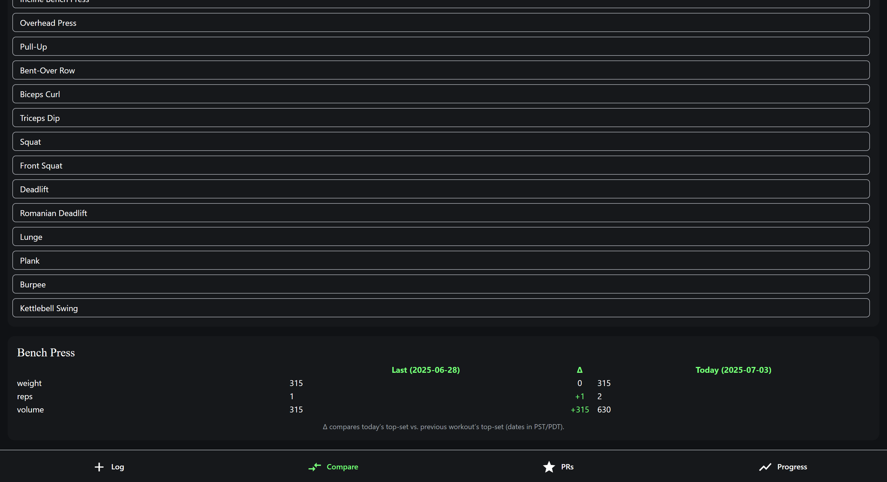
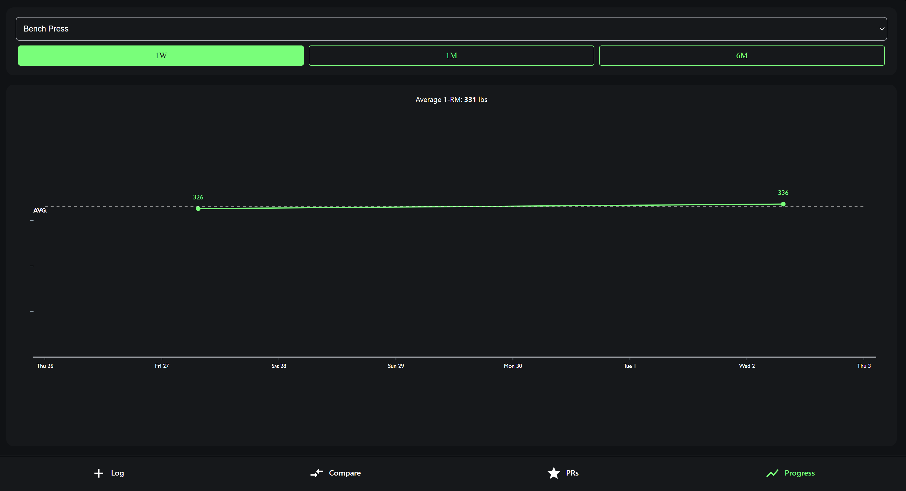
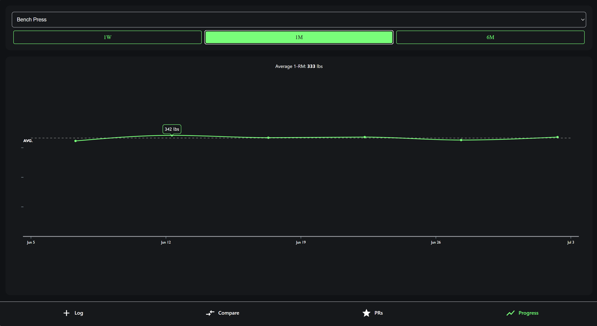
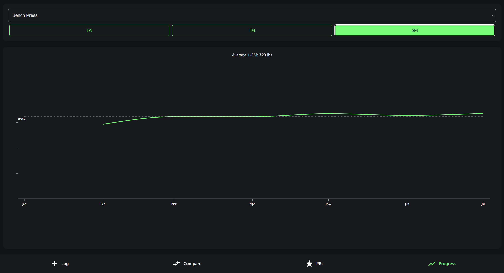

### 🏋️‍♂️ Whoop Progression Tracker  
[▶ Watch 40-second demo](https://youtu.be/nXs7u-w8V4)

|  |  | 
|:--:|:--:|
| Log Workout | Last-vs-This Compare |

| |  |  |
|:--:|:--:|:--:|
| 1-Week | 1-Month | 6-Month |

- Built React Native module in **< 3 weeks** (≈ 1,900 LoC)  
- Validated with 25+ weightlifters _(including non-Whoop users)_; **100%** said they’d use this lightweight tracker  
- **95%** of 20 survey responders said they’d use a feature like this  
- Added **Add-Exercise** tab to eliminate need for official API sync  
- Feedback from **Whoop VP Growth & Sr Staff PM** → invited to upcoming beta
